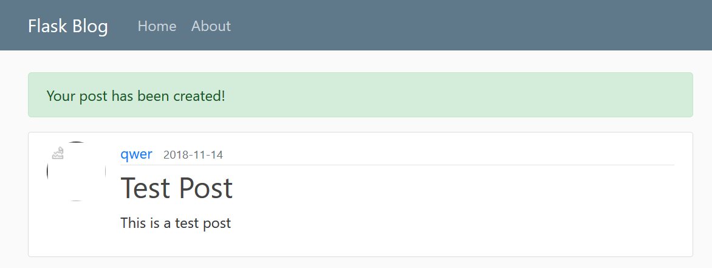

# Flask Blogging App
### Flask based blogging app to demonstrate CRUD opeations.

## Features
* Provides a basic infratructure on top of which many applications can be built.
* CRUD methodology with SQL connectivity is displayed.
* Register and Login features are provided.
* Insert new post, delete a post and updation is provided for the repective owner.
* Pagination features is also displayed.
* Whole app built using flask blueprint making it MVC application (Model View Controller).

## Technologies & Libraries
* Python3
* Flask
* Wtforms
* SQLAlchemy
* Flask-blueprint
* OS
* HTML, CSS
* Bootstrap

## Screenshots

### Home Page with Blog Posts

### New Post

### New Post Created

### Update and Delete Post

### Account Information

